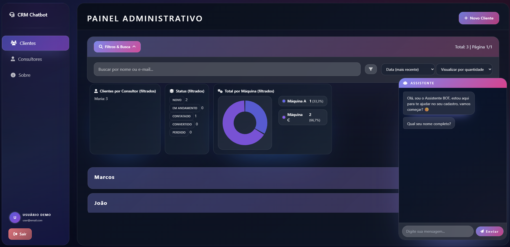

# CRM + Chatbot

Este README está em português. [Read in English](README_EN.md) 🇺🇸

Aplicação full stack JavaScript que apresenta um mini CRM moderno conectado a um chatbot com cara de WhatsApp. O foco é demonstrar UX refinada, acessibilidade desde o dia zero e boas práticas de engenharia (validações unificadas, testes automatizados, arquitetura modular).

> Projeto educacional/portfólio: os dados são fictícios e **não devem ser usados em produção** sem endurecer segurança, persistência e monitoramento.

## 🔗 Demo & Preview
- **Live demo:** [chatbot-crm-peuq.onrender.com](https://chatbot-crm-peuq.onrender.com)
- **Screenshot:**

  

## 🚀 Tech Stack
- **Frontend:** ES Modules puros + Tailwind CSS
- **Backend:** Node.js 18 + Express 5
- **Testes:** Jest, Supertest e snapshots
- **Logs & observabilidade:** Pino + pino-http
- **CI/CD:** GitHub Actions (lint, testes, build de schemas/CSS)

## 🌐 Visão Geral

O CRM possibilita captar, organizar e acompanhar leads com uma SPA leve (sem frameworks pesados) estilizada em Tailwind. O chatbot embarcado capta os dados do lead, envia para o shell principal via `postMessage`, e o CRM faz todo o trabalho de normalização, validação e atribuição automática de consultor.

## ✨ Principais Recursos

- Cadastro de clientes com modais e editor inline, preservando contexto
- Filtros avançados por Cidade, Máquina, Consultor e Status com estado persistido
- Paginação configurável (25/50/100/Todos) e ordenação múltipla por coluna
- Busca unificada por nome/e-mail e métricas dinâmicas por status, consultor e máquina
- Aba Consultores com painel assíncrono de clientes por especialista
- Chatbot responsivo que encaminha leads automaticamente para o CRM
- Linha do tempo de status + exportação de clientes em CSV
- Acessibilidade desde o markup: navegação via teclado, ARIA consistente, feedback visual contido
- Layout responsivo mobile-first com glassmorphism e painel lateral recolhível
- Camadas reutilizáveis de validação, normalização e logging

## 🧩 Arquitetura

| Camada | Como funciona |
| ------ | ------------- |
| Backend (Express 5) | API REST em `/api/*`, estáticos servidos a partir de `public/`, middlewares de log/erro centralizados. |
| Modelos / Lógica | Regras de domínio e orquestração em `models/` e `public/js/crm/logic.js`, isolando persistência e apresentação. |
| Validação | Schema único (`validators/schema/clienteSchema.js`) compartilhado por backend e frontend. |
| Estilização | Tailwind customizado em `src/tailwind.css`, tokens de design e variáveis globais compiladas para `public/styles/app.css`. |

### 🎨 UI & Tailwind

- Design system próprio com variáveis CSS, gradientes e sombras encapsulados em camadas Tailwind.
- Breakpoints mobile-first: sidebar comprimida, chatbot em tela cheia e páginas específicas (como "Sobre") adaptadas para displays menores.
- `npm run build:css` gera o bundle minificado; `npm start` executa `prestart` (build de schemas + CSS) antes de subir o servidor.
- Estilos de selects, modais e cartões afinados para contrastes adequados e acessibilidade.

### 🔐 Validação Unificada (Backend + Frontend)
- Schema declarativo descreve campos, tipos, padrões e mensagens.
- Script `npm run build:schemas` exporta versões JSON e ES Module para consumo no front.
- `validatorCore` aplica os mesmos normalizadores (nome, telefone, e-mail) que o backend, evitando divergência.
- Inclusão de novos campos envolve atualizar o schema, disparar o build e consumir no front/backend sem repetir regras.

### 💾 Persistência Abstrata (ClienteRepository)
- `FileClienteRepository` mantém os dados em JSON com operações assíncronas, escrita atômica e fila de writes para evitar corrida.
- Mudar de armazenamento exige apenas implementar outro repositório (ex.: Mongo, PostgreSQL, SQLite) com a mesma assinatura e trocar a instância em `clienteModel`.

### 📊 Observabilidade & Logs
- Logging estruturado com `pino` + `pino-http`, nivelado via `LOG_LEVEL`.
- `errorHandler` central padroniza payloads de erro; stack trace só aparece em dev/test.
- Suporte a `pino-pretty` quando fora de produção para leitura mais amigável.

As regras de validação residem em um único schema (`clienteSchema`). Enquanto o backend usa `validateWithSchema`, o frontend consome a versão gerada para garantir mensagens coerentes e normalização alinhada. O guardião para novos campos é simples: editar o schema, rodar o build e utilizar o campo em ambas as camadas.

| Frontend SPA | ES Modules que carregam "partials" via `viewLoader.js`, mantendo shell estável. |
| Chatbot | Rodando em iframe (`public/html/chatbot.html`), conversa baseada em fluxo guiado e integração por `postMessage`. |

## 🗂 Estrutura de Pastas (resumida)

```
public/
  html/         # views clientes, consultores, sobre, chatbot
  js/
    crm/        # lógica principal do CRM, renderização, filtros
    chatbot/    # fluxo de perguntas, DOM e validação do widget
  styles/       # CSS compilado (app.css) e temas
models/         # modelos e camada de repositório
controllers/    # controladores Express
routes/         # rotas HTTP
validators/     # esquema e validadores reutilizáveis
utils/          # normalizadores, logger, helpers
```

> Persistência atual é **em memória (arquivo JSON)**. Reiniciar o servidor limpa os dados. Evoluir para banco real envolve criar um novo repositório e plugar no modelo.

## 🚀 Como Executar Localmente

Pré-requisitos: [Node.js 18+](https://nodejs.org/)

```bash
npm install
npm start
```

A aplicação sobe em `http://localhost:3000`. O `npm start` executa `npm run build:schemas && npm run build:css` antes de iniciar o servidor, garantindo que Tailwind e schema estejam atualizados. Para rebuild manual do CSS use `npm run build:css` sempre que alterar `src/tailwind.css`.

## 🔗 Endpoints Principais

| Método | Rota | Descrição |
| ------ | ---- | --------- |
| GET | `/api/clientes?pagina=1&pageSize=25&sort=nome:asc&status=novo` | Lista paginada com filtros e ordenação |
| HEAD | `/api/clientes` | Retorna `X-Total-Count` para paginação |
| OPTIONS | `/api/clientes` | Informa métodos permitidos |
| GET | `/api/clientes/:id` | Recupera cliente por ID |
| POST | `/api/clientes` | Cria um ou vários clientes |
| PUT | `/api/clientes/:id` | Atualização completa |
| PATCH | `/api/clientes/:id` | Atualização parcial |
| DELETE | `/api/clientes/:id` | Remove cliente |
| GET | `/api/meta/version` | Devolve versão atual da aplicação |

Payload de criação/edição:

```json
{
  "nome": "Exemplo",
  "email": "exemplo@dominio.com",
  "telefone": "(11) 99999-9999",
  "cidade": "São Paulo",
  "maquina": "Máquina A",
  "horario": "Manhã",
  "status": "novo",
  "consultor": "(opcional)"
}
```

Resposta paginada típica:

```json
{
  "data": [{ "id": 123, "nome": "..." }],
  "page": 1,
  "pageSize": 25,
  "total": 120,
  "totalPages": 5,
  "sort": "dataCadastro:desc",
  "filters": {
    "status": "novo",
    "cidade": null,
    "maquina": null,
    "consultor": null,
    "texto": null
  }
}
```

## 🤖 Integração do Chatbot
- Fluxo guiado coleta nome, email, telefone, cidade, máquina e melhor horário.
- Cada resposta passa pelos validadores compartilhados; a etapa da máquina mostra cards selecionáveis.
- Ao final, os dados são enviados via API; se estiver embutido no CRM, um `postMessage` sincroniza o novo lead com o shell imediatamente.
- Em caso de falha de rede, há fallback para `postMessage` e feedback por toasts.

## 🧠 Atribuição Automática de Consultor
1. O lead seleciona uma máquina de interesse.
2. Repositório de consultores é filtrado por especialidade compatível.
3. Um consultor é escolhido randômicamente dentre os elegíveis.
4. Se ninguém for compatível, o lead permanece sem consultor associado (para handling manual).

## ♿ Acessibilidade e UX
Primeiro ciclo de melhorias priorizou comportamento previsível para leitores de tela e navegação por teclado.

### Principais Decisões
- Lista de clientes renderizada como `<ul role="list">` + `<li>` expansíveis com `role="button"`.
- Painel de filtros e cabeçalho possuem `aria-expanded`/`aria-pressed` sincronizados.
- Contadores dinâmicos usam `role="status"` + `aria-live="polite"` para feedback não intrusivo.
- Modal de edição tem `role="dialog"`, `aria-modal="true"`, trap de foco e fechamento por Esc.
- Painéis analíticos ocultos recebem `aria-hidden` para minimizar ruído.

### Interações de Teclado
| Componente | Teclas | Resultado |
| ---------- | ------ | --------- |
| Card de cliente | Enter / Espaço | Expande ou colapsa o card atualizando ARIA |
| Modal | Esc | Fecha e devolve foco para o acionador |
| Toggle Filtros Avançados | Enter / Clique | Exibe/esconde painel mantendo estado narrado |
| Header de filtros | Enter / Espaço / Ctrl+Shift+F | Alterna compactação do cabeçalho e painéis |

### ARIA / Semântica Utilizada
| Recurso | Uso |
| ------- | --- |
| `role="list"` | Estrutura semântica da listagem principal |
| `role="button"` em `<li>` | Indica que o item é acionável/expandível |
| `aria-expanded` | Estado de expansão dos cards e painéis |
| `aria-pressed` | Estado dos toggles (filtros, cards) |
| `role="status"` + `aria-live="polite"` | Atualizações sutis de contadores |
| `role="dialog"` + `aria-modal` | Modal acessível com foco controlado |
| `aria-hidden` dinâmico | Evita leitura de conteúdo oculto |

### Foco & Gestão de Ciclo
- Modal abre com foco no campo "Nome" após a animação.
- Trap de foco impede fuga usando Tab/Shift+Tab.
- Ao fechar, o foco retorna para o elemento que acionou o modal.

### Possíveis Evoluções Futuras
- Realizar rodadas de testes com NVDA/VoiceOver e ajustar descrições contextuais.
- Disponibilizar modo de alto contraste e preferências de animação.
- Acrescentar tour guiado acessível que destaque filtros e painéis.
- Automatizar auditorias com axe-core/pa11y em pipelines.

> Objetivo: manter a interface escalável sem frameworks pesados e acessível para quem navega só via teclado ou leitor de tela.

## 🔄 Evoluções Futuras (Sugestões)
- Integração com provedores externos (marketing, help desk) via webhooks.
- Relatórios agendáveis com exportação em PDF e compartilhamento seguro.
- Notificações push/web para leads quentes.
- Motor de automações tipo "if-this-then-that" com histórico.
- Empacotamento oficial (Docker Compose) + guia de deploy cloud.

## 🧪 Testes & Qualidade

- Jest cobre unidade e integração (`tests/*.test.js`).
- Supertest valida rotas HTTP.
- ESLint + Prettier garantem padronização.
- GitHub Actions roda lint, testes e build em Node 18/20.

Scripts úteis:

```
npm test        # executa a suíte completa
npm run lint    # análise estática
npm run format  # checagem de formatação
npm run format:fix # corrige formatação automaticamente
```

Áreas cobertas atualmente: normalizadores, validador unificado, seleção de consultor, integração `/api/clientes` (CRUD + paginação).

### Backlog Técnico
- Expandir cobertura end-to-end com Playwright (fluxo chatbot → CRM).
- Adicionar testes de performance (Lighthouse/WebPageTest) na CI.
- Instrumentar métricas de uso opt-in (Matomo/PostHog) sem rastrear dados sensíveis.

## ⚠️ Aviso
Projeto educativo. Não armazene dados sensíveis. Adicione autenticação, rate limiting, logs de auditoria e infraestrutura robusta antes de qualquer uso real.

## 📄 Licença
Distribuído sob a licença **MIT**. Consulte o arquivo `LICENSE` para detalhes.

## 🙌 Créditos
Criado por **Caio Marques (Hiidoko)**  \\
[LinkedIn](https://linkedin.com/in/hiidoko)

Se o projeto te ajudou, deixe uma ⭐. Aberto a feedbacks e oportunidades — vamos conversar sobre este trabalho ou possíveis vagas pelo LinkedIn.
