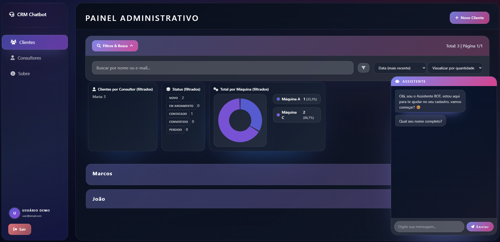

# CRM + Chatbot

This README is in English. [Leia em português](README_PT.md) 🇧🇷

Full-stack JavaScript application that showcases a modern mini CRM connected to a WhatsApp-style chatbot. The goal is to highlight polished UX, accessibility from day one, and solid engineering practices (shared validations, automated tests, modular architecture).

> Educational/portfolio project: data is fictional and **must not be used in production** without hardening security, persistence, and monitoring.

## 🔗 Demo & Preview
- **Live demo:** [chatbot-crm-peuq.onrender.com](https://chatbot-crm-peuq.onrender.com)
- **Screenshot:**

  

## 🚀 Tech Stack
- **Frontend:** Native ES Modules + Tailwind CSS
- **Backend:** Node.js 18 + Express 5
- **Testing:** Jest, Supertest, and snapshots
- **Logging & observability:** Pino + pino-http
- **CI/CD:** GitHub Actions (lint, tests, schema/CSS build)

## 🌐 Overview

The CRM collects, organizes, and monitors leads through a lightweight SPA rendered with Tailwind. The embedded chatbot captures lead details, sends them to the main shell via `postMessage`, and the CRM handles normalization, validation, and automatic consultant assignment.

## ✨ Key Features

- Client creation with modals or inline edition, keeping context intact
- Advanced filters by City, Machine, Consultant, and Status with persisted state
- Configurable pagination (25/50/100/All) and multi-column sorting
- Unified search by name/email plus live metrics by status, consultant, and machine
- Consultants tab with an async panel listing leads by specialist
- Responsive chatbot that forwards leads straight to the CRM
- Status timeline + CSV export of clients
- Accessibility baked into the markup: keyboard navigation, consistent ARIA, restrained visual feedback
- Mobile-first responsive layout with glassmorphism and collapsible sidebar
- Reusable layers for validation, normalization, and logging

## 🧩 Architecture

| Layer | Purpose |
| ----- | ------- |
| Backend (Express 5) | REST API under `/api/*`, static assets served from `public/`, centralized logging/error middlewares. |
| Models / Logic | Domain orchestration inside `models/` and `public/js/crm/logic.js`, separating persistence from presentation. |
| Validation | Single schema (`validators/schema/clienteSchema.js`) shared between backend and frontend. |
| Styling | Tailwind customization in `src/tailwind.css`, design tokens compiled to `public/styles/app.css`. |

### 🎨 UI & Tailwind

- Custom design system with CSS variables, gradients, and shadows wrapped in Tailwind layers.
- Mobile-first breakpoints: compact sidebar, full-screen chatbot, and tuned pages like "Sobre" (About) for smaller displays.
- `npm run build:css` outputs the minified bundle; `npm start` runs `prestart` (schema + CSS build) before launching the server.
- Selects, modals, and cards styled for proper contrast and accessibility.

### 🔐 Unified Validation (Backend + Frontend)
- Declarative schema defines fields, types, patterns, and messages.
- `npm run build:schemas` exports JSON and ES Module versions for the frontend.
- `validatorCore` applies the same normalizers (name, phone, email) used by the backend, preventing drift.
- Adding new fields requires updating the schema, running the build, and consuming the generated module—no duplicated logic.

### 💾 Abstracted Persistence (ClienteRepository)
- `FileClienteRepository` stores data in JSON with async operations, atomic writes, and a write queue to avoid race conditions.
- Switching storage only requires a new repository implementation (e.g., Mongo, PostgreSQL, SQLite) plugged into `clienteModel`.

### 📊 Observability & Logs
- Structured logging with `pino` + `pino-http`, level-controlled via `LOG_LEVEL`.
- Central `errorHandler` standardizes error payloads; stack traces only surface in dev/test.
- Optional `pino-pretty` support outside production for friendlier logs.

Validation rules live in a single schema (`clienteSchema`). The backend relies on `validateWithSchema`, while the frontend consumes the generated version to keep messages and normalization aligned. Adding a new field = edit schema → run build → use it on both ends.

| Frontend SPA | ES Modules loading "partials" via `viewLoader.js`, keeping the shell intact. |
| Chatbot | Runs inside an iframe (`public/html/chatbot.html`), guided conversation integrated via `postMessage`. |

## 🗂 Folder Structure (summary)

```
public/
  html/         # clients, consultants, about, chatbot views
  js/
    crm/        # core CRM logic, rendering, filters
    chatbot/    # chat flow, DOM helpers, validation
  styles/       # compiled CSS (app.css) and themes
models/         # data models and repository layer
controllers/    # Express controllers
routes/         # HTTP routes
validators/     # shared schema and validators
utils/          # normalizers, logger, helpers
```

> Current persistence is **in-memory (JSON file)**. Restarting the server wipes the data. Migrating to a real database means creating a new repository and wiring it into the model.

## 🚀 Running Locally

Prerequisites: [Node.js 18+](https://nodejs.org/)

```bash
npm install
npm start
```

The app runs at `http://localhost:3000`. `npm start` executes `npm run build:schemas && npm run build:css` beforehand, ensuring Tailwind and schema outputs are fresh. To rebuild CSS manually, run `npm run build:css` after editing `src/tailwind.css`.

## 🔗 Key Endpoints

| Method | Route | Description |
| ------ | ----- | ----------- |
| GET | `/api/clientes?pagina=1&pageSize=25&sort=nome:asc&status=novo` | Paginated list with filters and sorting |
| HEAD | `/api/clientes` | Returns `X-Total-Count` for pagination |
| OPTIONS | `/api/clientes` | Lists allowed methods |
| GET | `/api/clientes/:id` | Fetch client by ID |
| POST | `/api/clientes` | Create one or multiple clients |
| PUT | `/api/clientes/:id` | Full update |
| PATCH | `/api/clientes/:id` | Partial update |
| DELETE | `/api/clientes/:id` | Remove client |
| GET | `/api/meta/version` | Returns current app version |

Sample payload:

```json
{
  "nome": "Exemplo",
  "email": "exemplo@dominio.com",
  "telefone": "(11) 99999-9999",
  "cidade": "São Paulo",
  "maquina": "Máquina A",
  "horario": "Manhã",
  "status": "novo",
  "consultor": "(optional)"
}
```

Typical paginated response:

```json
{
  "data": [{ "id": 123, "nome": "..." }],
  "page": 1,
  "pageSize": 25,
  "total": 120,
  "totalPages": 5,
  "sort": "dataCadastro:desc",
  "filters": {
    "status": "novo",
    "cidade": null,
    "maquina": null,
    "consultor": null,
    "texto": null
  }
}
```

## 🤖 Chatbot Integration
- Guided flow asks for name, email, phone, city, machine, and preferred contact time.
- Each answer runs through shared validators; the machine step displays selectable cards.
- Upon completion, data is posted to the API; when embedded, a `postMessage` syncs the new lead with the CRM shell immediately.
- Network issues trigger a fallback `postMessage` and toast feedback.

## 🧠 Automatic Consultant Assignment
1. The lead picks a machine of interest.
2. Consultant repository is filtered by matching specialty.
3. One consultant is randomly selected from the eligible list.
4. If none match, the lead stays unassigned for manual handling.

## ♿ Accessibility & UX
Initial iteration focused on predictable behavior for screen readers and keyboard-only navigation.

### Key Decisions
- Client list rendered as `<ul role="list">` + `<li>` items acting as `role="button"`.
- Filter panel and header expose `aria-expanded`/`aria-pressed` state.
- Dynamic counters use `role="status"` + `aria-live="polite"` for non-intrusive updates.
- Edit modal includes `role="dialog"`, `aria-modal="true"`, focus trap, and Escape dismissal.
- Hidden analytics panels receive `aria-hidden` to reduce noise.

### Keyboard Interactions
| Component | Keys | Result |
| --------- | ---- | ------ |
| Client card | Enter / Space | Expand or collapse card, updating ARIA |
| Modal | Esc | Close and return focus to trigger |
| Advanced Filters toggle | Enter / Click | Show/hide panel while narrating state |
| Filters header | Enter / Space / Ctrl+Shift+F | Collapse/expand header and panels |

### ARIA / Semantics Used
| Feature | Purpose |
| ------- | ------- |
| `role="list"` | Semantic structure for the main listing |
| `role="button"` on `<li>` | Signals items are actionable/expandable |
| `aria-expanded` | Tracks expansion state of cards/panels |
| `aria-pressed` | Tracks toggle state (filters, cards) |
| `role="status"` + `aria-live="polite"` | Soft updates for counters |
| `role="dialog"` + `aria-modal` | Accessible modal with managed focus |
| `aria-hidden` (dynamic) | Keeps assistive tech from reading hidden sections |

### Focus & Lifecycle
- Modal opens with focus on the "Name" field after animation.
- Focus trap prevents escaping with Tab/Shift+Tab.
- On close, focus returns to the element that launched the modal.

### Future Accessibility Enhancements
- Run NVDA/VoiceOver sessions and refine contextual descriptions.
- Offer high-contrast mode and animation preferences.
- Add an accessible guided tour spotlighting filters and dashboards.
- Automate audits with axe-core/pa11y in CI.

> Goal: keep the interface framework-light and inclusive for keyboard-only or screen reader users.

## 🔄 Future Enhancements
- Integrations with external providers (marketing, help desk) via webhooks.
- Scheduled reports with PDF export and secure sharing.
- Push/web notifications for hot leads.
- Automation engine (if-this-then-that) with history.
- Official packaging (Docker Compose) + cloud deployment guide.

## 🧪 Testing & Quality

- Jest covers unit and integration flows (`tests/*.test.js`).
- Supertest exercises HTTP routes.
- ESLint + Prettier enforce code style.
- GitHub Actions runs lint, tests, and builds on Node 18/20.

Useful scripts:

```
npm test        # run full test suite
npm run lint    # static analysis
npm run format  # check formatting
npm run format:fix # auto-fix formatting issues
```

Current coverage highlights: normalizers, shared validator, consultant selection, `/api/clientes` integration (CRUD + pagination).

### Technical Backlog
- Expand end-to-end coverage with Playwright (chatbot → CRM flow).
- Add performance checks (Lighthouse/WebPageTest) to CI.
- Instrument opt-in usage metrics (Matomo/PostHog) without tracking sensitive data.

## ⚠️ Disclaimer
Educational project. Do not store sensitive data. Add authentication, rate limiting, audit logs, and production-grade infrastructure before any real-world use.

## 📄 License
Distributed under the **MIT** License. See `LICENSE` for details.

## 🙌 Credits
Built by **Caio Marques (Hiidoko)**  \
[LinkedIn](https://linkedin.com/in/hiidoko)

If this project helped you, consider leaving a ⭐. Open to feedback and opportunities—let's chat about this work or potential roles on LinkedIn.
